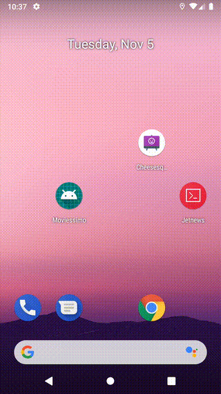

# moviessimo

[](https://ktlint.github.io/)

A sample android app that uses [TMDB](https://www.themoviedb.org) to show movie list and details. 
Mainly build to experiment with various libraries/frameworks/technologies.

## Project specifications

Project features:

* 100% [Kotlin](https://kotlinlang.org/)
* [Android Jetpack libraries](https://developer.android.com/jetpack) (ViewModel, Lifecycle, Navigation)
* Jetpack Compose (for now in [experiment/jetpack-compose](https://github.com/atabekm/moviessimo/tree/experiment/jetpack-compose) branch)
* Clean architecture ([wiki](https://github.com/atabekm/moviessimo/wiki/Clean-architecture-diagrams))
* Multi-modular approach ([wiki](https://github.com/atabekm/moviessimo/wiki/Gradle-dependencies))
* Single activity (with [Navigation component](https://developer.android.com/guide/navigation/navigation-getting-started) to navigate between fragments)
* MVI presentation pattern (AKA unidirectional data flow)
* Coroutines
* Dependency injection
* Unit and instrumentation (UI) tests

## Tech stack



Libraries used in the app:

* Google + JetBrains
    * [Kotlin](https://kotlinlang.org/)
    * [Coroutines](https://kotlinlang.org/docs/reference/coroutines-overview.html)
    * [Jetpack](https://developer.android.com/jetpack)
        * [Lifecycle](https://developer.android.com/topic/libraries/architecture/lifecycle)
        * [ViewModel](https://developer.android.com/topic/libraries/architecture/viewmodel)
        * [Navigation](https://developer.android.com/topic/libraries/architecture/navigation/)
        * [Compose](https://developer.android.com/jetpack/compose)
* Dependency injection
    * [Koin](https://insert-koin.io/)
* Network + Image
    * [Retrofit](https://square.github.io/retrofit/)
    * [Coil](https://github.com/coil-kt/coil)
* Tests
    * [Unit Tests](https://en.wikipedia.org/wiki/Unit_testing) ([JUnit4](https://junit.org/junit4/))
    * [Mockk](https://mockk.io/)
    * [Espresso](https://developer.android.com/training/testing/espresso/)
    * [Kakao](https://github.com/agoda-com/Kakao)
* Gradle
    * [Gradle Kotlin DSL](https://docs.gradle.org/current/userguide/kotlin_dsl.html)
* Static analysis tools
    * [ktlint](https://ktlint.github.io/)
    * [detekt](https://arturbosch.github.io/detekt/)
* Continuous integration
    * [Github Actions](https://github.com/features/actions)

## Building the app

### Get the source code

```
git clone https://github.com/atabekm/moviessimo.git
cd moviessimo
```

### Add your TMDB API key to local.properties file

The app uses [TMDB](https://www.themoviedb.org) to get movie lists and information, so you need to get your API key. Afterwards, append your 
API key to the bottom of local.properties, it should look something like:
```
api_key=<YOUR_API_KEY>
```

### Compile the app
To build the app, just use the following gradle command:

```
./gradlew assembleDebug
```

## Running tests

### Unit tests

To run unit tests, execute the following gradle command:

```
./gradlew test
```

### UI tests

To run UI tests, execute the following gradle command:

```
./gradlew connectedAndroidTest
```